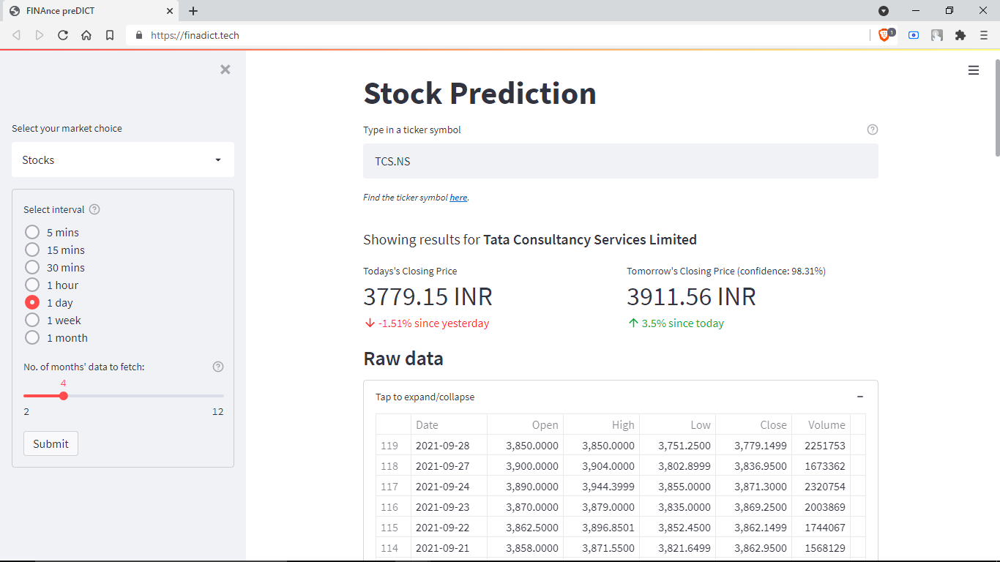
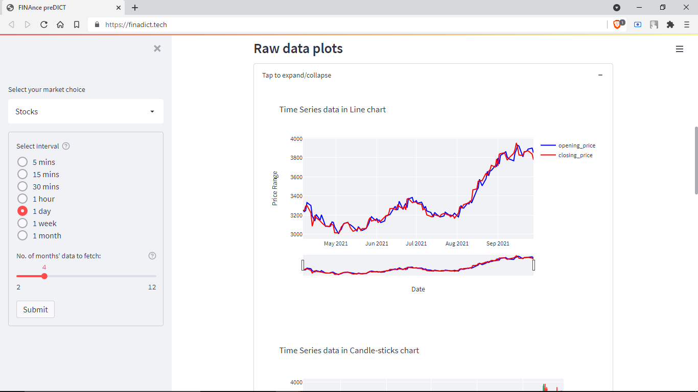
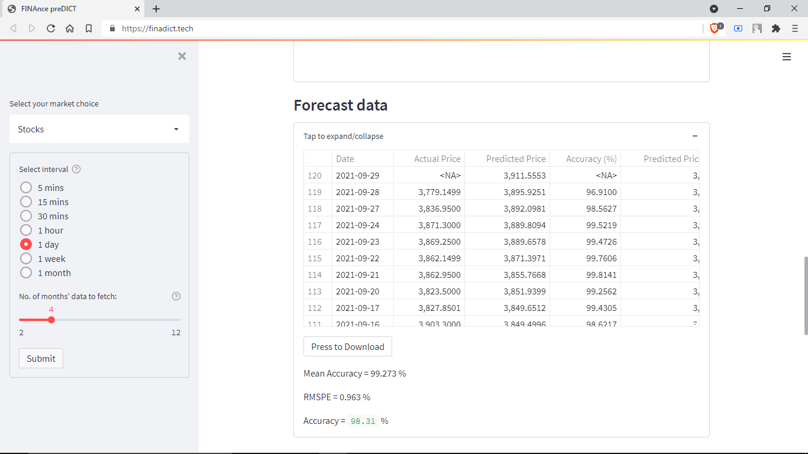
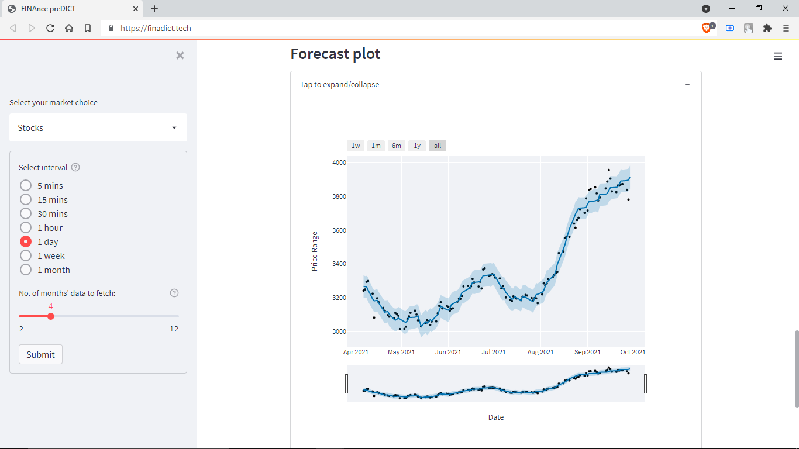

# FINAnce preDICT

A simple and easy to use WebApp for Stocks / Cryptocurreny / Foreign Exchange prices prediction.

## Live website : [finadict.tech](https://finadict.tech/)

### File structure map can be found [here](https://app.codesee.io/maps/98139390-2284-11ec-9a58-dd146936e2c1).

## Install locally

### On Linux 

> **Ubuntu / Debian**

```shell
sudo apt-get update && apt-get upgrade
sudo apt-get install python3-pip
git clone https://github.com/subhayu99/finadict.git
cd finadict
sudo pip3 install -r requirements.txt
streamlit run app.py
```

### On a docker container

> **Using docker image**

```shell
sudo docker run -d -i --name finadict -h finadict -p 80:80 -e STREAMLIT_SERVER_PORT=80 subhayu99/finadict:latest
```

> **Using Dockerfile**

```shell
mkdir finadict && cd finadict
wget https://raw.githubusercontent.com/subhayu99/finadict/main/Dockerfile
sudo docker build -t subhayu99/finadict:latest .
sudo docker run -d -i --name finadict -h finadict -p 80:80 -e STREAMLIT_SERVER_PORT=80 subhayu99/finadict:latest
```

> **Using docker-compose**

```shell
mkdir finadict && cd finadict
wget https://raw.githubusercontent.com/subhayu99/finadict/main/docker-compose.yaml
sudo docker-compose up -d
```

---

# Program Screenshot

### Stock's Raw Data
<br>
<p align="center"></p>
<br>

### Raw Data Graph
<br>
<p align="center"></p>
<br>

### Stock's Predicted Data
<br>
<p align="center"></p>
<br>

### Predicted Data Graph
<br>
<p align="center"></p>
<br>

---

# Contributors Wall:

All Contributions of the Contributors can be found in the [__Contributions__](https://github.com/subhayu99/finadict/graphs/contributors) section and info of Contributors at [__Contributors.md__](https://github.com/subhayu99/finadict/blob/master/Contributors.md) file.
<table>
  <tr>
    <td align="center">
      <a href="https://github.com/subhayu99">
              <br />
              <sub>
                  <b>
                      <strong>Subhayu Kumar Bala</strong>
                  </b>
              </sub>
          </a>
      </td>
    <td align="center">
      <a href="https://github.com/DeepNinja07x">
              <br />
              <sub>
                  <b>
                      <strong>Deepraj Rakshit</strong>
                  </b>
              </sub>
          </a>
      </td>
  </tr>
  </table>
